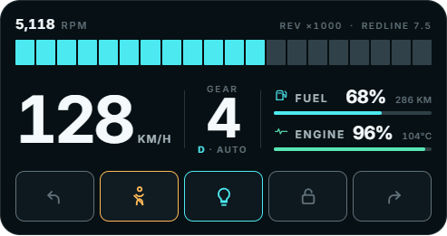

# SpeedPulse

A [FiveM](https://fivem.net) vehicle cluster HUD built with React, TypeScript, and Vite. It shows speed, RPM, gear, fuel, engine health, and status icons on a compact matte panel, anchored to the bottom-right of the screen. The HUD only appears while the player is in a vehicle.

**Author:** Simon Gomes  
**Version:** 1.0.0

## HUD



## Features

- Compact half-scale cluster docked to the **bottom-right**
- Visible **only while in a vehicle** (driver seat by default; hides with the pause menu)
- RPM bar driven by a FiveM value from `0.0` to `1.0`; equal-height segments, color only when lit
- Speed (KM/H or MPH), gear, fuel, and engine readouts
- Icon-only status row: turn signals, seat belt, lights, and lock

## Resource layout

```
SpeedPulse/
  fxmanifest.lua
  client.lua            NUI visibility + vehicle telemetry
  server.lua            Server entry (hooks later)
  config.lua            Tunables (units, interval, redline)
  docs/
    hud.png             README preview screenshot
  ui/                   React + Vite NUI project
    src/
      components/
      app.tsx
      types.ts
    dist/               Built NUI (required in-game)
```

## Install (FiveM)

1. Place this folder in your server `resources` directory (already under `[local]` is fine).
2. Build the UI once:

```bash
cd ui
yarn install
yarn build
```

3. Ensure `server.cfg` (or your resources list) includes:

```cfg
ensure SpeedPulse
```

4. Restart the resource or the server.

## UI development

```bash
cd ui
yarn install
yarn dev
```

Open the local URL Vite prints, usually `http://127.0.0.1:5173`. The browser preview uses mock HUD data. In-game, `client.lua` pushes live updates via `SendNUIMessage`.

| Command        | What it does                       |
| -------------- | ---------------------------------- |
| `yarn dev`     | Start the Vite dev server          |
| `yarn build`   | Typecheck and build into `ui/dist` |
| `yarn preview` | Preview the production build       |
| `yarn lint`    | Run ESLint                         |

## Config

Edit `config.lua`:

| Key              | Default | Meaning                                      |
| ---------------- | ------- | -------------------------------------------- |
| `UpdateInterval` | `100`   | Client → NUI refresh rate (ms)               |
| `UseMetric`      | `true`  | `true` = KM/H, `false` = MPH                 |
| `Redline`        | `7.5`   | Redline shown on the RPM scale (x1000)       |
| `HideWhenOnFoot` | `true`  | Hide HUD when not in a vehicle               |
| `DriverOnly`     | `true`  | Only show for the driver seat                |

## Cluster

`rpm` is a fraction of the full scale. `0` leaves every segment idle, `0.58` lights 58% of the bar, and `1` lights the whole bar. The readout converts that fraction into RPM using the redline.

```tsx
<RpmBar rpm={0.58} redline={7.5} />
```

Lit segments are cyan, then amber in the warning zone and red at redline. Idle segments stay gray. All segments share the same height.

Status chips are **icon-only** (no labels). Tone follows `active`:

| Icon              | Active     | Inactive   |
| ----------------- | ---------- | ---------- |
| Left / right turn | Cyan       | Muted gray |
| Seat belt         | Cyan       | Amber      |
| Lights            | Cyan       | Muted gray |
| Lock              | Cyan       | Muted gray |
